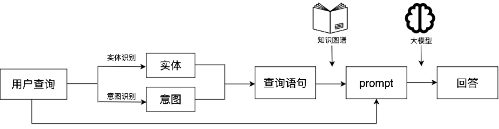
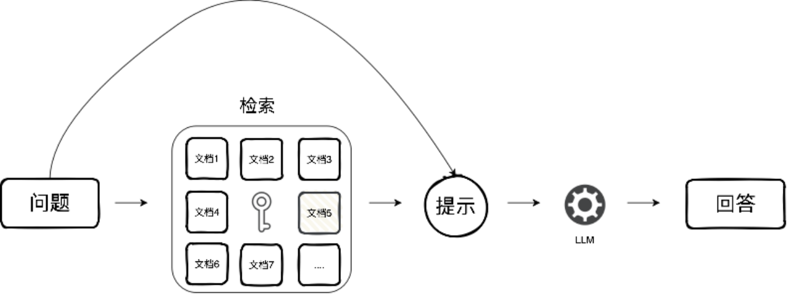
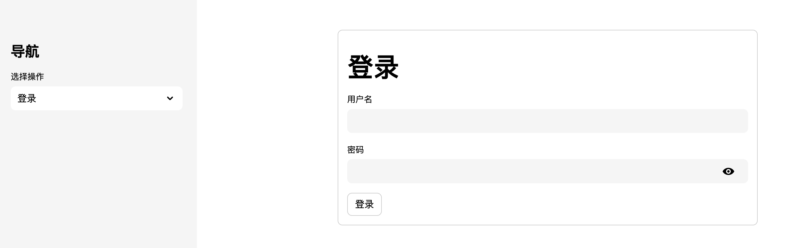
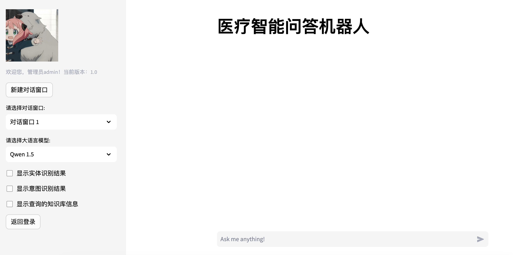
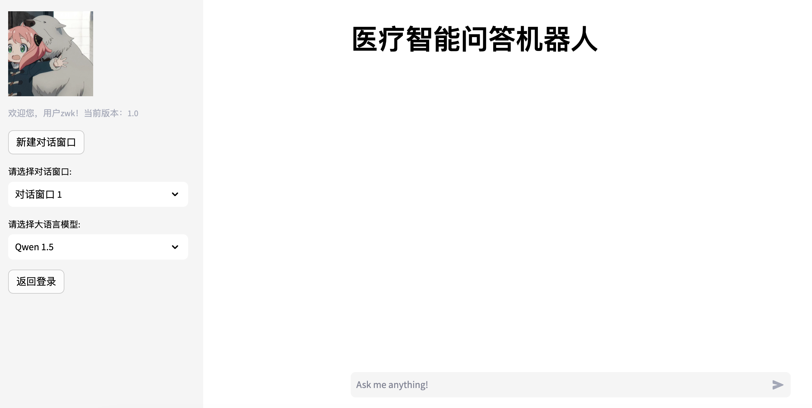
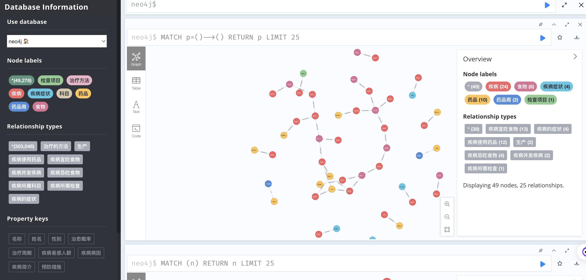

# 医疗领域 Hybrid RAG 智能问答系统

本项目是一个面向医疗问答场景的 Hybrid RAG Demo，基于公开医疗知识图谱问答项目的思路与数据进行二次改造和扩展。项目保留了原有的医疗知识图谱、实体识别、意图识别和 Streamlit 交互框架，并在此基础上接入 Qwen API 与 Qdrant 向量检索，形成「Neo4j Graph RAG + Qdrant Vector RAG」融合问答流程。

项目主要用于学习、课程展示和面试讲解，不用于真实医疗诊断。

## 项目来源与改造说明

本项目的数据和基础实现参考了以下公开资源：

- Open-KG 疾病知识图谱数据集：http://data.openkg.cn/dataset/disease-information
- RAGOnMedicalKG：https://github.com/liuhuanyong/RAGOnMedicalKG
- QASystemOnMedicalKG：https://github.com/liuhuanyong/QASystemOnMedicalKG

在原有医疗知识图谱问答思路上，本项目主要做了这些改造：

- 将原本依赖本地大模型或 Ollama 的调用方式改为 Qwen OpenAI 兼容 API，降低本地部署硬件门槛。
- 新增 Qdrant 向量检索模块，支持医学 PDF/TXT 文档导入、chunk 切分、embedding 生成和 top-k 语义检索。
- 将 Neo4j 结构化图谱结果与 Qdrant 非结构化文档片段共同注入 Prompt，实现 Graph RAG + Vector RAG 融合。
- 保留 BERT/RoBERTa + BiLSTM 医疗实体识别，并结合规则匹配、Aho-Corasick 和 TF-IDF 实体对齐。
- 在 Streamlit 页面中加入用户登录、管理员视图、多轮对话窗口、模型选择和检索结果调试展示。

## 核心功能

- 用户登录与注册：支持普通用户和管理员两类角色。
- 医疗实体识别：识别疾病、药品、症状、检查项目、科室、治疗方法等实体。
- 意图识别：通过 Prompt 调用 Qwen API 判断用户问题对应的医疗查询意图。
- 知识图谱检索：基于 Neo4j 查询疾病属性、药品、症状、检查、科室、治疗方法等结构化知识。
- 向量文档检索：基于 Qdrant 检索医学 PDF/TXT 文档片段，补充非结构化证据。
- Hybrid RAG 回答生成：融合图谱证据和向量检索证据后，由 Qwen API 生成最终回答。
- 管理员调试视图：展示实体识别、意图识别、图谱查询和向量检索结果，便于解释系统流程。

## 技术栈

- Python
- Streamlit
- Neo4j
- Qdrant
- PyTorch
- Transformers
- BERT/RoBERTa + BiLSTM
- sentence-transformers
- Qwen OpenAI 兼容 API

## 项目结构

```text
.
├── webui.py                         # 主问答页面与 RAG 流程
├── login.py                         # 登录/注册入口
├── build_up_graph.py                # Neo4j 医疗知识图谱构建
├── ner_model.py                     # 医疗实体识别模型
├── ner_data.py                      # NER 数据处理
├── ingest_docs.py                   # 文档导入入口
├── vector_rag/                      # Qdrant 向量检索模块
├── data/                            # 医疗知识图谱与训练数据
├── docs/                            # 技术方案和面试复习文档
├── img/                             # README 与界面截图
├── model/                           # 模型文件目录
├── tmp_data/                        # 临时数据
└── requirements.txt
```

## 环境准备

建议使用 Python 3.10。

```bash
conda create -n medical-rag python=3.10
conda activate medical-rag
pip install -r requirements.txt
```

## API Key 配置

项目不会在代码中保存真实 API Key。运行前需要在本机环境变量中配置：

```powershell
setx QWEN_API_KEY "你的 Qwen/DashScope API Key"
```

设置后请重新打开终端，使环境变量生效。

临时测试也可以在当前 PowerShell 窗口中执行：

```powershell
$env:QWEN_API_KEY="你的 Qwen/DashScope API Key"
```

## Neo4j 知识图谱构建

先安装并启动 Neo4j，然后执行：

```bash
python build_up_graph.py --website http://localhost:7474 --user neo4j --password YourPassword --dbname neo4j
```

运行后会根据 `data/medical_new_2.json` 构建医疗知识图谱，并生成实体、关系相关的辅助文件。

## 向量文档导入

如果需要使用 Qdrant Vector RAG，可以通过文档导入脚本把医学 PDF/TXT 加入向量库：

```bash
python ingest_docs.py
```

向量检索相关代码位于 `vector_rag/`，主要包括文档加载、文本切分、embedding 生成、Qdrant 写入和检索结果格式化。

## 启动系统

```bash
streamlit run login.py
```

启动后可在浏览器中进入登录页面。管理员视图可以查看系统中间结果，普通用户视图用于模拟医疗问答流程。

## 运行流程

```text
用户问题
  -> 医疗实体识别
  -> Qwen API 意图识别
  -> Neo4j 图谱检索
  -> Qdrant 向量检索
  -> 图谱证据 + 文档证据融合
  -> Qwen API 生成最终回答
  -> Streamlit 页面展示
```

## 截图

### 系统流程



### RAG 流程



### 登录页面



### 管理员页面



### 用户页面



### Neo4j 图谱示例



## 注意事项

- 本项目是学习与展示项目，不构成医疗建议。
- 真实 API Key 不应写入代码，也不应提交到 GitHub。
- `model/chinese-roberta-wwm-ext/` 和 `model/best_roberta_rnn_model_ent_aug.pt` 体积较大，当前通过 `.gitignore` 排除，需要运行时自行准备。
- `tmp_data/user_credentials.json` 是本地测试账号文件，包含明文测试账号密码，不建议上传到公开仓库。
- 如果需要复现完整 NER 流程，请下载或训练对应 RoBERTa/BERT 模型权重。

## 简历描述参考

**医疗领域 Hybrid RAG 智能问答系统 | Python, Streamlit, Neo4j, Qdrant, BERT, Qwen API**

- 基于 Streamlit 构建医疗问答系统，支持用户登录注册、管理员调试视图、多轮对话窗口和检索结果展示。
- 使用 BERT/RoBERTa + BiLSTM 实现医疗实体识别，结合 Aho-Corasick 规则匹配和 TF-IDF 实体对齐。
- 基于 Neo4j 构建医疗知识图谱，实现疾病、药品、症状、检查项目、科室和治疗方法等结构化查询。
- 设计 Prompt-based 意图识别流程，调用 Qwen OpenAI 兼容 API 识别用户问题中的多类别查询意图。
- 新增 Qdrant 向量检索模块，支持医学 PDF/TXT 文档导入、chunk 切分、embedding 生成和 top-k 语义检索。
- 实现 Neo4j Graph RAG 与 Qdrant Vector RAG 融合，将结构化图谱结果和非结构化文档片段共同注入 Prompt，提升回答依据覆盖率。
